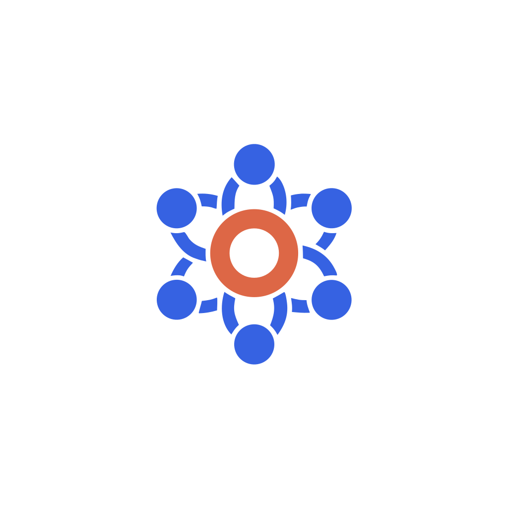
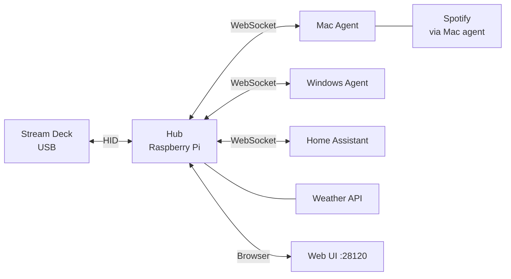

<p align="center">
  
</p>

# OmniDeck

A self-hosted Stream Deck controller that turns your hardware deck into a multi-computer command center. One deck, one hub (Raspberry Pi), multiple computers.

**Key features:**
- Control multiple computers from one deck — buttons automatically follow keyboard focus or active app
- Plugin system for Spotify, Discord, Slack, Home Assistant, weather, and more
- Live state on buttons (album art, playback position, HA entity state, unread counts)
- Web UI for configuration — no config files to edit

## How it works



The **hub** runs on a Raspberry Pi, manages the Stream Deck hardware, loads plugins, and serves the configuration UI. **Agents** run on your Mac/PC and receive commands from the hub — keystrokes, mouse clicks, and app control stay on the machine that needs them. Cloud plugins (Weather) run entirely on the hub. Hybrid plugins (Spotify) run their API calls on the agent but send state back to the hub for button rendering.

## Quick start

1. Install the hub on a Raspberry Pi:
   ```bash
   curl -sSf https://raw.githubusercontent.com/wemcdonald/OmniDeck/main/deploy/install.sh | bash
   ```
2. Open `http://<pi-hostname>.local:28120` in your browser
3. Install the agent on your Mac/PC from the Agents page
4. Install plugins from the Plugins page

→ [Full install guide](docs/getting-started.md) · [Architecture](docs/how-it-works.md) · [Plugin guide](docs/plugin-guide.md)

## Plugins

| Plugin | Type | What it does |
|--------|------|-------------|
| Home Assistant | Hub | Toggle lights, climate, media players, covers, locks |
| Spotify | Agent | Playback control, album art, track info |
| Discord | Agent | Mute/deafen, voice channels, per-user volume |
| Slack | Hub | Unread counts, DMs, Do Not Disturb |
| Weather | Hub | Current conditions and forecast for any location |
| Google Meet | Agent | Mute, camera, hand raise, reactions |
| Zoom | Agent | Mute, camera, screen share, recording |
| Clock | Hub | Analog and digital clock display |
| Counter | Hub | Increment counter with long-press reset |
| OS Control | Agent | Keystrokes, mouse, app launching, window management |
| Sound | Hub/Agent | Volume, mute, media keys, audio device switching |

→ [Install plugins](docs/plugin-install.md) · [Write a plugin](docs/plugin-guide.md)

## Development

```bash
pnpm install
pnpm --filter hub dev      # hub + web UI (localhost:28120)
pnpm --filter agent dev    # agent (connects to hub)
```

See [ARCHITECTURE.md](docs/ARCHITECTURE.md) for the full technical deep-dive.
