← [Docs](README.md)

# OmniDeck — Architecture

> An open-source, plugin-driven macro deck system that bridges a physical Stream Deck across multiple computers, cloud services, and home automation — controlled from a Raspberry Pi.

## Table of Contents

1. [Overview](#overview)
2. [System Architecture](#system-architecture)
3. [Hub](#hub)
4. [Agent](#agent)
5. [Plugin System](#plugin-system)
6. [Mode System](#mode-system)
7. [Orchestration Engine](#orchestration-engine)
8. [Communication Protocol](#communication-protocol)
9. [Configuration](#configuration)
10. [Button Rendering](#button-rendering)
11. [Security Model](#security-model)
12. [Development Guide](#development-guide)

---

## Overview

### What OmniDeck Does

OmniDeck lets a single Stream Deck control multiple computers and networked services from a Raspberry Pi hub. It handles dynamic context switching — when you shift focus from your Mac to your Windows PC, the deck adapts. Media controls route to the active player. Home Assistant entities show live state on buttons. Discord mute follows whichever machine is in voice.

### Design Principles

1. **Plugin-first**: All integrations are plugins. The core is a thin orchestration layer.
2. **Config-as-code**: YAML is the source of truth. The web UI reads and writes the same files.
3. **Multi-computer native**: One deck controlling N machines with focus-aware context switching.
4. **Extensible**: Third parties can write plugins with their own actions, state, config UI, and presets.
5. **Offline-resilient**: Machines come and go. The deck degrades gracefully — buttons for offline machines dim or show status, never crash.

### Key Technology Choices

| Decision | Choice | Rationale |
|----------|--------|-----------|
| Hub language | TypeScript (Node.js) | WebSocket/API glue code; shares types with the web UI; pnpm workspace |
| Agent language | TypeScript (Bun) | Single compiled binary via `bun build --compile`; same language as hub |
| Agent desktop app | Tauri 2 (Rust + React) | Native system tray, deep link pairing, auto-start; wraps the Bun agent binary |
| Stream Deck HID | `@elgato-stream-deck/node` | Battle-tested library; supports all Stream Deck models |
| Button rendering | `sharp` + `@napi-rs/canvas` | Fast image compositing on Pi's ARM; canvas for text/emoji |
| Web framework | Hono | Lightweight, Edge-compatible, runs on Node.js |
| Web UI | Vite + React + shadcn/ui | Full SPA served from the hub at port 9211 |
| Config format | YAML | Human-readable, hot-reloadable, supports `!secret` tags |
| Package manager | pnpm | Workspace support for hub, agent, agent-app, and packages |
| Communication | WebSocket (JSON) | Persistent, bidirectional, low-latency on LAN |
| Icon system | Material Symbols (`ms:` prefix) | 3000+ MIT-licensed variable icons via `@iconify-json/material-symbols` |

---

## System Architecture

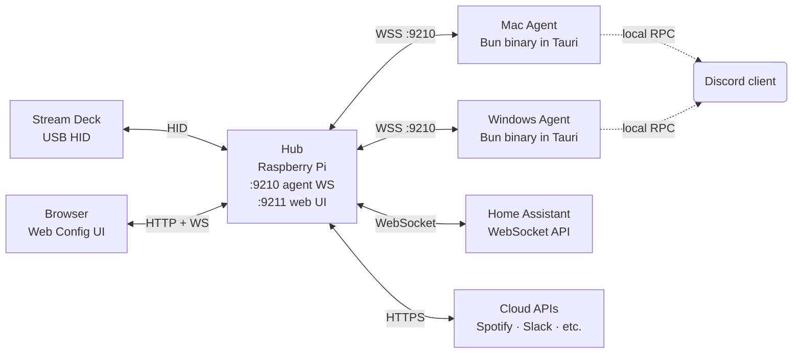

### Hub internals

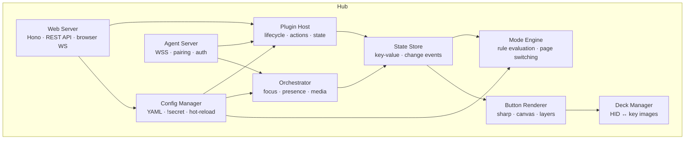

### Data flow: button press

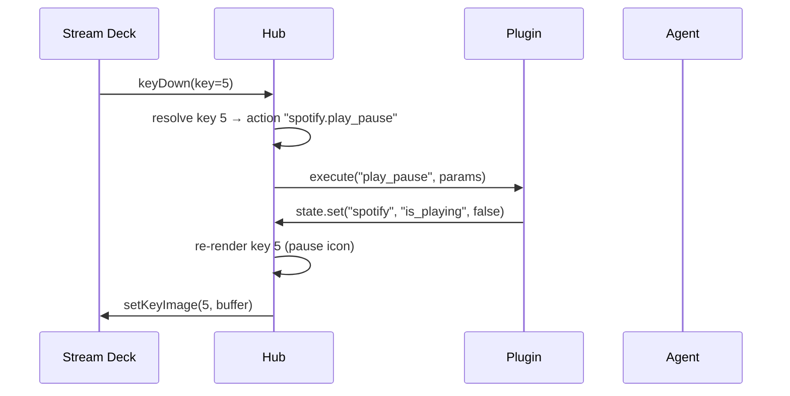

### Data flow: external state change

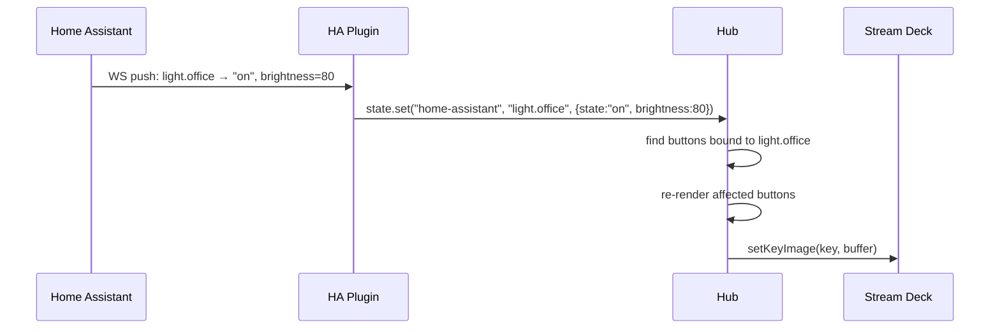

### Data flow: focus switch

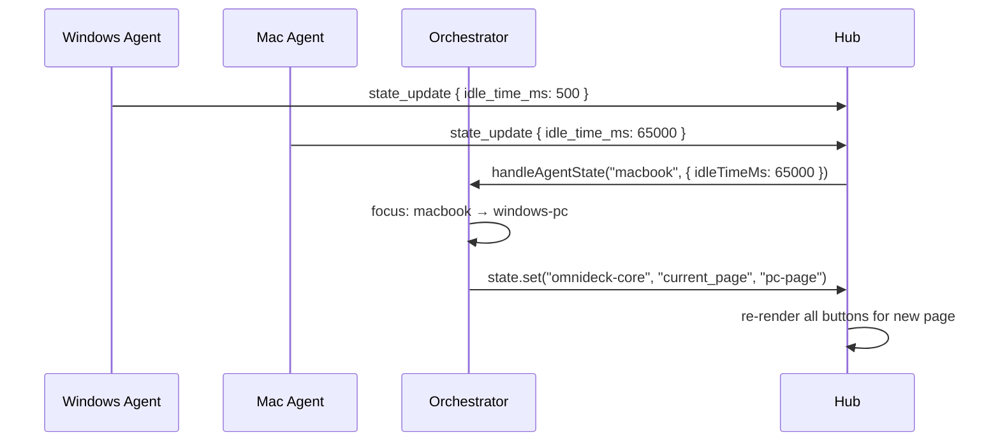

---

## Hub

The hub is a single Node.js process on the Raspberry Pi. It is the brain of the system.

### Source layout (`hub/src/`)

| Directory | Purpose |
|-----------|---------|
| `index.ts` | Entry point — reads config, starts all subsystems |
| `hub.ts` | `Hub` class — wires everything together |
| `deck/` | Physical deck HID interface (`PhysicalDeck`, `MockDeck`) |
| `renderer/` | Button image compositor |
| `config/` | YAML loading, `!secret` resolution, Zod validation, hot-reload |
| `plugins/` | Plugin host, registry, esbuild bundler, built-in plugins |
| `server/` | Agent WebSocket server, TLS, pairing, mDNS |
| `web/` | Hono HTTP server, REST API routes, browser WebSocket broadcaster |
| `orchestrator/` | Focus tracker, presence manager, media router |
| `modes/` | Mode engine — rule evaluation, page switching |
| `state/` | Central key-value state store |

### Web frontend (`hub/web/`)

A full Vite + React 18 SPA, built separately and served as static files by the Hono server.

- **Routing**: React Router v6
- **State**: TanStack Query v5 (server state)
- **UI**: shadcn/ui + Tailwind CSS
- **Icons**: `@iconify/react` with Material Symbols
- **YAML editor**: CodeMirror 6

The browser connects to a WebSocket at `/ws` for live updates (button state changes, agent connect/disconnect, log streaming).

### Config Manager

Reads YAML from `~/.omnideck/config/`, resolves `!secret` tags against `secrets.yaml`, and validates with Zod. Watches files via `chokidar` for hot-reload.

```typescript
interface ConfigManager {
  load(configDir: string, secretsPath: string): Promise<void>;
  reload(): Promise<void>;
}
```

Hot-reload behavior:
1. Re-read and validate all YAML
2. **Validation fails** → log error, keep running with old config
3. **Plugin config changed** → call `plugin.onConfigChange(newConfig)`; if not implemented, full plugin restart
4. **Page/button config changed** → update state, re-render affected buttons
5. **Mode/orchestrator config changed** → update engine in-place

### State Store

The central nervous system. Plugins write; the renderer and mode engine subscribe.

```typescript
interface StateStore {
  set(pluginId: string, key: string, value: unknown): void;
  get(pluginId: string, key: string): unknown;
  getAll(pluginId: string): Map<string, unknown>;
  onChange(cb: (pluginId: string, key: string, value: unknown) => void): void;
  batch(fn: () => void): void;
}
```

Implementation: EventEmitter-based, no framework. When a plugin calls `state.set("home-assistant", "light.office", { state: "on", brightness: 80 })`, the store emits a change event, the mode engine re-evaluates, and the renderer checks if any visible buttons depend on that key.

---

## Agent

A TypeScript CLI compiled with Bun (`bun build --compile`) into a single self-contained binary — no Node.js, no npm install required on the target machine.

### Agent-App (desktop wrapper)

A **Tauri 2** application (Rust shell + React frontend) that:
- Runs the agent binary as a child process (Tauri sidecar)
- Shows a system tray / menu bar icon with status
- Handles `omnideck://pair?...` deep links for one-click pairing from the web UI
- Manages auto-start on login (OS login items)

Distributed as `.dmg` (macOS), `.msi`/`.exe` (Windows), `.deb`/`.AppImage` (Linux).

### Agent internals

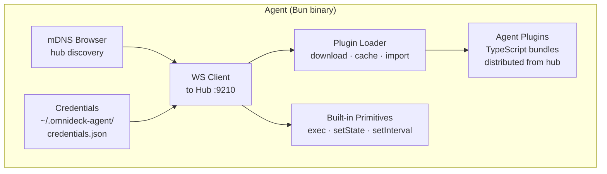

### Plugin distribution

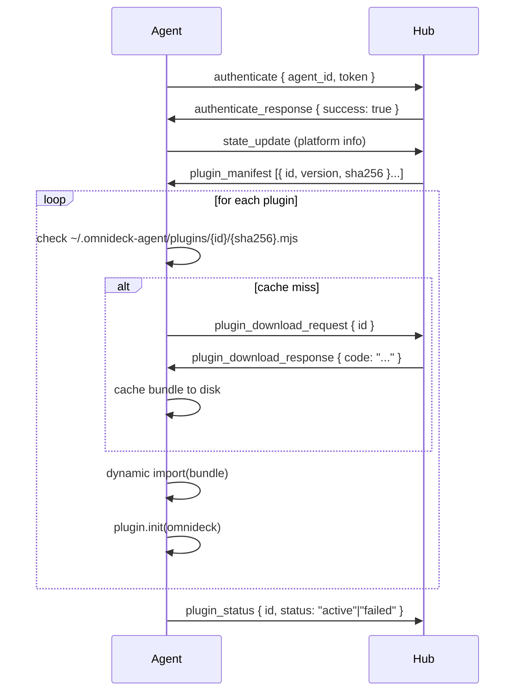

### Agent lifecycle

1. Read stored credentials from `~/.omnideck-agent/credentials.json`
2. If no credentials → mDNS browse for `_omnideck-hub._tcp`, prompt for pairing code
3. Connect via `wss://`, authenticate with stored token
4. Receive `plugin_manifest`, download and load plugins
5. Begin streaming state to hub (idle time, active window, volume) — pushed on change
6. Execute commands from hub, route to plugin action handlers
7. Auto-reconnect with 1s / 2s / 4s / 8s / 30s backoff on disconnect

### Built-in agent primitives

Always available to agent plugins via the `OmniDeck` object:

| Primitive | Description |
|-----------|-------------|
| `exec(cmd, args)` | Run a shell command, returns `{ stdout, stderr, exitCode }` |
| `setState(key, value)` | Push state to hub state store |
| `platform` | `"darwin" \| "windows" \| "linux"` |
| `setInterval(fn, ms)` / `clearInterval` | Managed timers, auto-cleared on plugin unload |
| `log.info/warn/error` | Forwarded to hub logs |
| `config` | Plugin config pushed from hub YAML (read-only) |

Platform-specific implementations:
- **macOS**: `osascript`, `ioreg` (idle time), CoreAudio
- **Windows**: PowerShell, Win32 via `exec()`

---

## Plugin System

All integrations are plugins. The core provides the mechanism; plugins provide the behavior.

### Plugin types

**Hub-only** — communicate with cloud/network APIs directly from the Pi. Only `hub.ts`.

**Hub + Agent** — need local OS access. Include `hub.ts` (deck/button side) and `agent.ts` (execution side). The hub is always the coordinator; the agent executes and reports back.

### Package format

```
~/.omnideck/plugins/my-plugin/
├── manifest.yaml     # Identity, metadata, setup instructions
├── hub.ts            # Hub-side: actions, state providers, presets
└── agent.ts          # Agent-side: optional, distributed by hub
```

**manifest.yaml**:
```yaml
id: my-plugin
name: "My Plugin"
version: "1.0.0"
platforms: [darwin]        # omit for all platforms
hub: hub.ts
agent: agent.ts            # omit for hub-only plugins
icon: ms:extension
category: Utility
setup_steps:
  - "Get your API key from [example.com](https://example.com)"
source_url: "https://github.com/example/my-plugin"
```

Config schemas and action param schemas live in `hub.ts` as Zod objects — not in the manifest.

### Built-in plugins

These four plugins are compiled into the hub and always available:

| Plugin | Type | Description |
|--------|------|-------------|
| `omnideck-core` | Hub | Page navigation, brightness, config reload |
| `sound` | Hub + Agent | Volume, mute, media keys, audio device switching |
| `home-assistant` | Hub | HA entities — lights, switches, sensors, climate, covers, locks |
| `os-control` | Hub + Agent | Keystrokes, app launch/focus, sleep, lock, active window |

Additional plugins (Spotify, Discord, Slack, Weather, etc.) are in the [OmniDeck-plugins](https://github.com/wemcdonald/OmniDeck-plugins) repository and installed via the web UI.

### Hub plugin interface

```typescript
interface OmniDeckPlugin {
  id: string;
  name: string;
  version: string;
  icon?: string;                // e.g. "ms:home"
  configSchema?: z.ZodType;    // Validated config from YAML

  init(context: PluginContext): Promise<void>;
  destroy(): Promise<void>;
  onConfigChange?(newConfig: unknown): Promise<void>;
}

interface PluginContext {
  config: unknown;              // Validated plugin config
  state: PluginStateStore;      // Read/write state store
  log: PluginLogger;

  registerAction(action: ActionDefinition): void;
  registerStateProvider(provider: StateProviderDefinition): void;
  registerPreset(preset: ButtonPreset): void;
  setHealth(health: PluginHealth): void;

  // Page helpers
  scaffoldPage(id: string, config: PageConfig): void;
  registerPageProvider(id: string, resolve: () => PageConfig): void;

  onOrchestratorEvent(event: string, cb: (data: unknown) => void): void;
}
```

### Actions

An action is what happens when a button is pressed.

```typescript
interface ActionDefinition {
  id: string;
  name: string;
  description?: string;
  icon?: string;
  paramsSchema?: z.ZodObject<any>;
  execute(params: unknown, context: ActionContext): Promise<void>;
}

interface ActionContext {
  targetAgent?: string;   // Explicit target from button config
  focusedAgent?: string;  // Orchestrator's current focused device
  triggerAction(pluginId: string, actionId: string, params: unknown): Promise<void>;
}
```

**Agent targeting** (three-tier cascade):
1. Button `target` field — explicit override
2. Plugin `agent_order` config — plugin's preferred agent list
3. Orchestrator `focusedAgent` — the machine the user is currently on

### State providers

A state provider resolves the current visual state for a button.

```typescript
interface StateProviderDefinition {
  id: string;
  name: string;
  description?: string;
  icon?: string;
  paramsSchema?: z.ZodObject<any>;
  providesIcon?: boolean;
  templateVariables?: TemplateVariable[];
  resolve(params: unknown): StateProviderResult;
}

interface StateProviderResult {
  state: ButtonStateResult;      // Visual state (icon, label, background, etc.)
  variables: Record<string, string>; // Exposed for Mustache label templates
}
```

Labels can use Mustache syntax to reference provider variables: `"{{track_name}} — {{artist}}"`.

### Presets

Presets are pre-configured button templates that appear in the plugin browser for drag-and-drop onto the grid.

```typescript
interface ButtonPreset {
  id: string;
  name: string;
  description?: string;
  category?: string;
  icon?: string;
  action?: string;       // Action ID within same plugin
  stateProvider?: string; // State provider ID within same plugin
  defaults: {
    icon?: string;
    label?: string;       // Can use Mustache: "{{brightness_percent}}"
    topLabel?: string;
    background?: string;
    iconColor?: string;
  };
  paramsSchema?: z.ZodObject<any>;
}
```

### Agent plugin entry point

```typescript
import type { OmniDeck } from "@omnideck/agent-sdk";

export default function init(omnideck: OmniDeck) {
  const port = omnideck.config.port ?? 12345;

  omnideck.setInterval(async () => {
    const data = await fetch(`http://localhost:${port}/status`).then(r => r.json());
    omnideck.setState("status", data);
  }, 2000);

  omnideck.onAction("run_trigger", async (params) => {
    await fetch(`http://localhost:${port}/trigger/${params.name}`, { method: "POST" });
    return { success: true };
  });

  omnideck.onReloadConfig((newConfig) => { /* reconnect if needed */ });
  omnideck.onDestroy(() => { /* close connections */ });
}
```

Agent plugins are **pre-bundled by the hub** using esbuild before distribution. Agents receive a single resolved `.mjs` file and `dynamic import()` it — no npm install on the target machine.

---

## Mode System

Modes are named contexts that activate based on state conditions. When a mode activates, OmniDeck can automatically switch pages, trigger actions, and apply per-button overrides — making the deck context-aware without manual page switching.

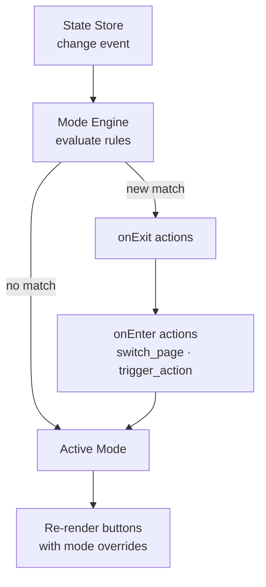

### Mode definition

```yaml
modes:
  - id: zoom-call
    name: "Zoom Call"
    icon: ms:video-call
    priority: 10            # lower = higher priority
    rules:
      - condition: and
        checks:
          - provider: zoom.call_state
            attribute: in_call
            equals: true
    onEnter:
      - switch_page: zoom
    onExit:
      - switch_page: home
```

### Rule evaluation

- A mode activates when **any** of its `rules` entries matches (top-level OR)
- Within a rule, `condition: "and"` requires all checks; `condition: "or"` requires any check
- Each `check` calls a state provider's `resolve()` and tests a named attribute
- `target` scopes a check to a specific agent: `target: macbook`
- `not: true` negates the result

Available comparators per check: `equals`, `not_equals`, `in`, `not_in`, `greater_than`, `less_than`, `contains`, `matches` (regex).

### Per-button mode overrides

Individual buttons can override their appearance or action when a specific mode is active:

```yaml
- pos: [0, 0]
  icon: ms:mic
  action: sound.toggle_mute
  modes:
    zoom-call:
      icon: ms:mic-off
      label: "Zoom Mute"
      action: zoom.toggle_mute
```

---

## Orchestration Engine

The orchestrator determines which machine is "focused" and routes commands accordingly.

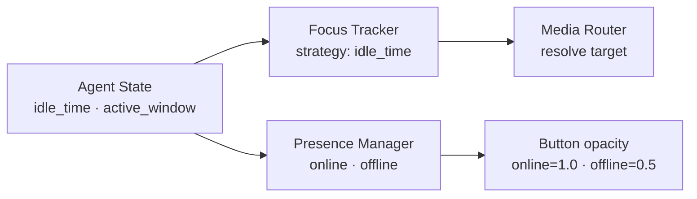

### Focus tracker

Determines which machine the user is currently using.

| Strategy | Behavior |
|----------|----------|
| `idle_time` (default) | The machine with the shortest idle time is focused. A machine becomes unfocused after `idle_threshold_ms` of no input. |
| `active_window` | Focus follows whichever machine most recently had a window change. |
| `manual` | Focus only changes on explicit `os-control.set_focus` action. |

When focus changes, the orchestrator optionally switches the active page:

```yaml
orchestrator:
  focus:
    strategy: idle_time
    idle_threshold_ms: 30000
    switch_page_on_focus: true
  device_pages:
    macbook: mac-page
    windows-pc: pc-page
```

### Media router

Resolves which agent (or hub) should receive media commands.

| Strategy | Behavior |
|----------|----------|
| `active_player` (default) | Route to whichever device Spotify reports as the active playback device. Falls back to focused device. |
| `focused` | Always route to the focused machine. |
| `manual` | User pins media to a specific device. |

### Presence manager

Tracks which agents are online. When an agent disconnects:
- Buttons targeting that agent dim to `opacity: 0.5`
- Actions targeting it return an error flash
- When the agent reconnects, buttons immediately refresh

---

## Communication Protocol

All hub ↔ agent communication uses WebSocket (`wss://` on port 9210) with JSON messages.

### Message envelope

```typescript
interface WsMessage {
  v: 1;         // protocol version
  type: string;
  id?: string;  // UUID for request/response correlation
  data: unknown;
  ts: string;   // ISO 8601 timestamp
}
```

### Message types

**Agent → Hub:**

| Type | Description |
|------|-------------|
| `pair_request` | First-time pairing with DECK-XXXX code |
| `authenticate` | Token auth on subsequent connections |
| `state_update` | Periodic push: idle time, active window, volume, platform |
| `command_response` | Result of a hub-issued command |
| `plugin_download_request` | Request plugin bundle by ID |
| `plugin_status` | Reports plugin active/failed after init |
| `plugin_state` | Plugin pushes state to hub state store |
| `plugin_log` | Plugin log message forwarded to hub |
| `plugin_active` | Plugin signals which agent it needs |

**Hub → Agent:**

| Type | Description |
|------|-------------|
| `pair_response` | Returns agent_id, token, CA cert |
| `authenticate_response` | Auth success/failure |
| `command` | Execute an action on the agent |
| `plugin_manifest` | List of plugins with version + sha256 |
| `plugin_download_response` | Bundled plugin JS code |
| `plugin_config_update` | Push new plugin config to agent |

### Design notes

- **No binary protocol**: JSON is human-debuggable with `wscat`. Payloads are small.
- **Request/response**: Commands use a UUID `id` field; responses include the same ID. Hub times out after 5s.
- **Partial state**: `state_update` sends only changed fields; hub merges into full state model.

---

## Configuration

### Directory layout

```
~/.omnideck/
├── config/
│   ├── config.yaml       # Main config: deck, plugins, orchestrator, modes, devices
│   └── pages/
│       ├── home.yaml     # Page definitions (one file per page, or all in config.yaml)
│       ├── media.yaml
│       └── ...
├── secrets.yaml          # API tokens (gitignore this)
├── agents.yaml           # Paired agent registry (hub-managed)
└── tls/                  # Auto-generated TLS certificates
    ├── ca.key
    ├── ca.crt
    ├── server.key
    └── server.crt

~/.omnideck-agent/        # On Mac/PC
└── credentials.json      # Stored pairing token (mode 0600)
```

### Main config (`config.yaml`)

```yaml
deck:
  brightness: 80
  idle_dim_after: 5m
  idle_dim_brightness: 20
  wake_on_touch: true
  default_page: home

devices:
  - id: macbook
    name: "Will's MacBook"
    platform: darwin
  - id: windows-pc
    name: "Will's PC"
    platform: windows

plugins:
  home-assistant:
    url: !secret ha_url
    token: !secret ha_token

  spotify:
    client_id: !secret spotify_client_id

  sound:
    default_target: auto

  os-control:
    default_target: auto
    agent_order: [macbook, windows-pc]

orchestrator:
  focus:
    strategy: idle_time
    idle_threshold_ms: 30000
    switch_page_on_focus: true
  device_pages:
    macbook: mac-page
    windows-pc: pc-page

modes:
  - id: zoom-call
    name: "Zoom Call"
    priority: 10
    rules:
      - condition: and
        checks:
          - provider: zoom.call_state
            attribute: in_call
            equals: true
    onEnter:
      - switch_page: zoom

hub:
  name: "My OmniDeck"

auth:
  password_hash: !secret hub_password_hash  # optional; bcrypt hash
  tls_redirect: false
```

### Secrets (`secrets.yaml`)

```yaml
ha_url: "ws://homeassistant.local:8123/api/websocket"
ha_token: "eyJ0eXAiOiJKV1QiLCJhbGciOiJIUz..."
spotify_client_id: "abc123"
hub_password_hash: "$2a$10$..."
```

Referenced from main config as `!secret <key>`. Never logged or exposed via any API.

### Page config

Pages can be in `config.yaml` or in separate files under `pages/`. All `.yaml` files in the config directory are merged.

```yaml
page: home
name: "Home"
columns: 5

buttons:
  - pos: [0, 0]
    preset: home-assistant.light_toggle
    params:
      entity_id: light.office

  - pos: [1, 0]
    action: spotify.play_pause
    icon: ms:play-pause
    label: "Play"
    state:
      provider: spotify.playback_state
      params: {}

  - pos: [2, 0]
    action: omnideck-core.change_page
    params: { page: media }
    icon: ms:music-note
    label: "Media"

  # Per-mode override example
  - pos: [4, 0]
    icon: ms:mic
    action: sound.toggle_mute
    modes:
      zoom-call:
        icon: ms:video-call
        action: zoom.toggle_mute
        label: "Zoom Mute"
```

### Button config schema

```yaml
- pos: [column, row]      # required

  # --- Appearance ---
  label: "Text"           # bottom label; supports Mustache: "{{var}}"
  top_label: "Text"       # top label; also supports Mustache
  scroll_label: true      # scroll long labels horizontally
  icon: "ms:icon-name"    # Material Symbols icon (ms: prefix)
  image: "./custom.png"   # custom image, relative to config dir
  background: "#1a1a2e"   # hex color
  icon_color: "#ffffff"
  label_color: "#ffffff"
  opacity: 1.0            # 0–1

  # --- Action ---
  action: "plugin.action_id"
  params: {}
  long_press_action: "plugin.action_id"
  long_press_params: {}

  # --- State (dynamic appearance) ---
  state:
    provider: "plugin.provider_id"
    params: {}
    when_true:
      icon: "ms:lightbulb"
      background: "#f59e0b"
    when_false:
      icon: "ms:lightbulb-outline"
      opacity: 0.4

  # --- Preset shorthand ---
  preset: "plugin.preset_id"
  params: {}

  # --- Targeting ---
  target: "device_id"     # override default agent target

  # --- Per-mode overrides ---
  modes:
    mode-id:
      action: "..."
      icon: "..."
      label: "..."
      # ... any appearance or action field
```

---

## Button Rendering

### Pipeline

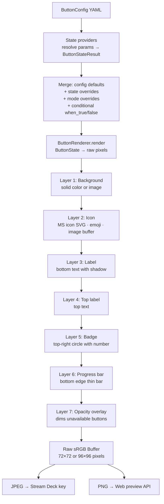

### ButtonState (renderer input)

```typescript
interface ButtonState {
  background?: string | Buffer;  // hex color or image buffer
  icon?: string | Buffer;        // "ms:icon-name", emoji, or image buffer
  iconFullBleed?: boolean;       // fill button edge-to-edge (no padding)
  iconColor?: string;            // tint color for MS icons
  label?: string;
  labelColor?: string;
  scrollLabel?: boolean;
  topLabel?: string;
  topLabelColor?: string;
  scrollTopLabel?: boolean;
  badge?: string | number;       // corner badge
  badgeColor?: string;
  opacity?: number;              // 0–1
  progress?: number;             // 0–1, thin bar at bottom
}
```

### Rendering notes

- **Output format**: Raw sRGB pixel data (no alpha), converted to JPEG for physical deck writes and PNG for web preview
- **Key resolution**: 72×72 (Stream Deck Original/MK.2), 96×96 (Stream Deck XL)
- **Icons**: Material Symbols SVGs are rendered via `@iconify/utils` + `sharp`; emoji via `@napi-rs/canvas` with bundled NotoColorEmoji
- **Scroll animation**: Labels that overflow scroll on a `scrollTick` counter, advanced each render cycle
- **Dirty tracking**: Only re-renders buttons whose state actually changed

---

## Security Model

### TLS certificate infrastructure

On first startup the hub generates a self-signed CA and server certificate in `~/.omnideck/tls/`:

- **CA cert** (`ca.crt`, `ca.key`): 4096-bit RSA, 10-year validity, CN=`OmniDeck CA`
- **Server cert** (`server.crt`, `server.key`): 2048-bit RSA, signed by CA, 1-year validity, SANs include `localhost`, `omnideck.local`, and the machine hostname
- Server certs are auto-renewed when within 30 days of expiry
- CA fingerprint (SHA-256) is advertised via mDNS TXT records

### Agent pairing

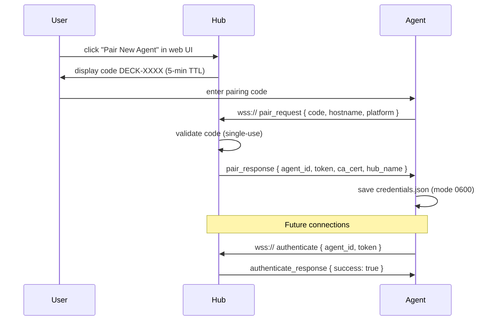

**Token storage**: Hub stores only the bcrypt hash of the token in `agents.yaml`. Tokens are never logged.

**Revocation**: The web UI lists all paired agents with last-seen timestamps. Revoking invalidates the token immediately — the agent must re-pair.

### Transport security

| Connection | Security |
|------------|----------|
| Agent ↔ Hub | TLS (`wss://` port 9210); agent pins CA cert received during pairing |
| Browser ↔ Hub | HTTP port 9211 by default; HTTPS on 9443 opt-in (requires installing CA cert in browser) |
| CA cert download | Always available at `/api/tls/ca.crt` over HTTP |

`OMNIDECK_HUB_URL` env var overrides hub address on the agent. `wss://` = TLS, `ws://` = plain (dev mode).

### Web UI password protection

Optional:
1. `hub_password_hash: !secret hub_password_hash` in config (bcrypt)
2. Hub serves a login page; sessions use HTTP-only cookies (in-memory, cleared on restart)
3. Without a password hash, the web UI is open (appropriate for trusted LANs)

### Hub discovery (mDNS)

The hub advertises as `_omnideck-hub._tcp` with TXT records:
- `name`: Hub display name (default: `"OmniDeck"`)
- `fp`: CA certificate fingerprint (SHA-256)

Agents browse this service on startup. `OMNIDECK_HUB_URL` bypasses discovery.

---

## Development Guide

### Toolchain

| Tool | Version | Purpose |
|------|---------|---------|
| Node.js | 22+ LTS | Hub runtime |
| pnpm | 9+ | Package management (workspace) |
| Bun | latest | Agent runtime + `bun build --compile` |
| Rust + Tauri CLI | stable | agent-app desktop wrapper |

### System dependencies (Pi)

| Package | Purpose |
|---------|---------|
| `fontconfig` | Font discovery for sharp/libvips text. Without it: `Cannot load default config file`. |

Install: `sudo apt install fontconfig`

### udev rules (Pi)

The Stream Deck HID device is owned by root. The hub user needs explicit access:

1. Copy `deploy/udev/50-stream-deck.rules` to `/etc/udev/rules.d/`
2. Run `udevadm control --reload-rules && udevadm trigger`
3. Ensure the hub user is in the `plugdev` group

Without this, the hub fails with `cannot open device with path /dev/hidraw*`.

### Hub

```bash
pnpm install
pnpm --filter hub dev          # tsx watch + Vite dev server
pnpm --filter hub build        # tsup → dist/index.js + Vite build
```

- **ESM only**: `"type": "module"` in package.json
- **tsconfig**: target `ES2023`, module `Node16`, strict mode
- **Dev runner**: `tsx watch` (no compile step)

### Agent

```bash
pnpm --filter agent dev        # bun run --watch src/index.ts
pnpm --filter agent build      # cross-platform Bun compile
```

Cross-platform binaries:
```bash
bun build src/index.ts --compile --target=bun-linux-x64   --outfile dist/omnideck-agent-linux-x64
bun build src/index.ts --compile --target=bun-darwin-arm64 --outfile dist/omnideck-agent-darwin-arm64
bun build src/index.ts --compile --target=bun-windows-x64  --outfile dist/omnideck-agent-windows-x64.exe
```

### Agent-app

```bash
cd agent-app
pnpm install
pnpm tauri dev     # dev mode with hot reload
pnpm tauri build   # produces .dmg / .msi / .deb
```

### Hub npm dependencies

| Package | Purpose |
|---------|---------|
| `@elgato-stream-deck/node` | Stream Deck HID |
| `sharp` | Image compositing (libvips, prebuilt ARM64) |
| `@napi-rs/canvas` | Text and emoji rendering |
| `@iconify-json/material-symbols` | Icon SVG data |
| `@iconify/utils` | SVG rendering utilities |
| `esbuild` | Agent plugin bundling |
| `hono` + `@hono/node-server` | HTTP/HTTPS web server |
| `ws` | WebSocket server (agents) |
| `yaml` | YAML parsing with `!secret` tag |
| `zod` | Schema validation |
| `chokidar` | Config file watching |
| `pino` | Structured JSON logging |
| `bonjour-service` | mDNS advertise and browse |
| `@peculiar/x509` | TLS certificate generation |
| `bcryptjs` | Password hash verification |

### Project structure

```
OmniDeck/
├── hub/
│   ├── src/              # Hub server (TypeScript, Node.js)
│   └── web/              # Web UI SPA (Vite + React)
├── agent/                # Agent CLI (TypeScript, Bun)
├── agent-app/            # Desktop wrapper (Tauri 2, Rust + React)
├── packages/
│   ├── agent-sdk/        # @omnideck/agent-sdk — OmniDeck interface for agent plugins
│   └── plugin-schema/    # @omnideck/plugin-schema — Zod manifest + plugin types
├── plugins/              # First-party plugins (seeded to ~/.omnideck/plugins/ on install)
├── deploy/
│   ├── install.sh        # curl | bash installer for Pi
│   ├── omnideck-hub.service  # systemd service
│   └── udev/             # Stream Deck udev rules
└── docs/                 # Documentation
```

### Developing without a Stream Deck

**MockDeck** — set `OMNIDECK_MOCK_DECK=1`:
- Logs key images as PNG files to `~/.omnideck/data/mock-deck/`
- Accepts key presses via stdin

The `MockDeck` implements the same `DeckManager` interface as `PhysicalDeck`, so all hub logic runs identically.

### Error handling

**Plugin errors**: Actions that `throw` are caught by the plugin host — log the error, flash the button red briefly, continue running. A plugin throwing >10 errors in 60 seconds is automatically disabled.

**Rendering errors**: If a state provider throws or returns invalid data, the button renders a dimmed fallback. Rendering never crashes the hub.

**Agent errors**: Command failures return `{ success: false, error }` over WebSocket. Disconnection triggers button dimming and automatic reconnection with exponential backoff.

### Logging

`pino` with structured JSON output. Levels: `debug`, `info`, `warn`, `error`. Each plugin and subsystem gets a named child logger. Agent logs are forwarded to the hub over WebSocket and appear in the hub log stream and web UI.
