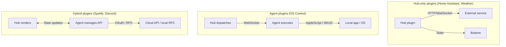
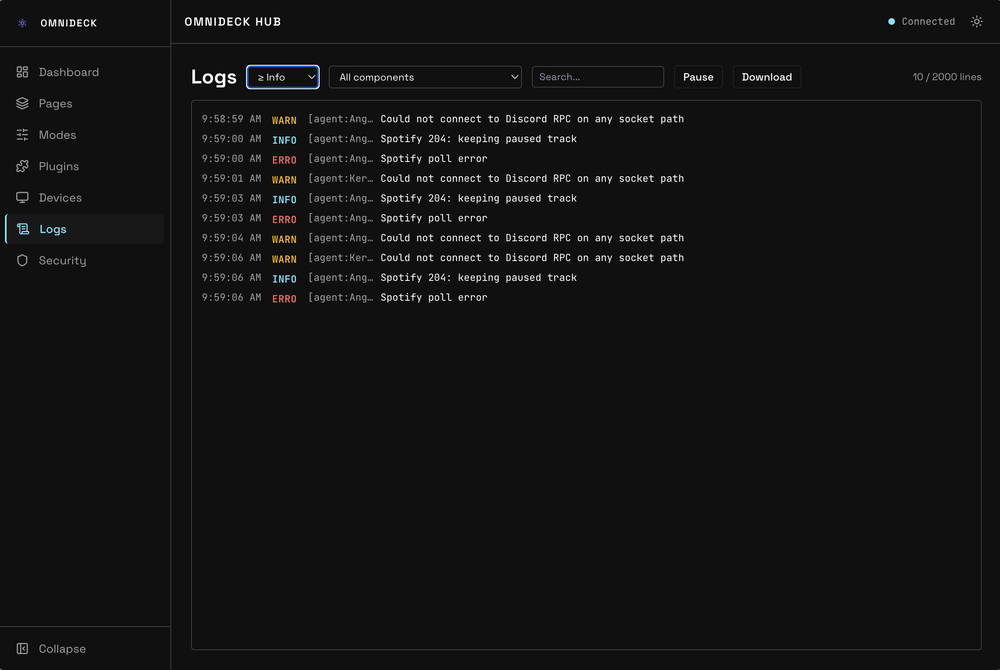

← [Docs](README.md)

# How OmniDeck Works

## Hub / Agent split

OmniDeck separates into two processes by design:

**The hub** runs 24/7 on the Raspberry Pi. It owns the Stream Deck hardware, renders button images, and coordinates everything. Because it runs on the Pi, it can reach your local network services — Home Assistant, Weather APIs, Slack — without any machine being awake.

**Agents** run on the computers you want to control. They handle things that must happen on a specific machine: sending keystrokes, clicking the mouse, controlling local apps, or talking to APIs that require OAuth tokens tied to that machine (Spotify, Discord). Agents connect back to the hub over WebSocket and stay connected while the machine is on. When a machine sleeps or shuts down, its agent disconnects gracefully and the hub dims the affected buttons.

This split means:
- Your deck stays functional even when your Mac is asleep — HA and weather buttons keep working
- Commands that need to run on your PC run on your PC, not the Pi
- Plugins that talk to cloud APIs can run wherever makes most sense

## Plugin types

Different integrations slot into different parts of the system:



**Hub-only plugins** (Home Assistant, Weather, Slack, Clock, Counter) run entirely on the Pi. They talk directly to external services and push state to buttons. No agent required.

**Agent plugins** (OS Control) run entirely on the agent machine. The hub dispatches the action over WebSocket and the agent executes it locally — a keystroke goes to the focused app, a mouse click lands on the right machine.

**Hybrid plugins** (Spotify, Discord, Google Meet, Zoom) split the work: the agent manages the API connection and OAuth tokens, while the hub handles button rendering. The agent sends state updates (current track, mic status) to the hub, and the hub sends actions (skip, mute) to the agent.

## Smart targeting

When you have multiple agents connected, OmniDeck needs to know which machine to send a button action to. The routing follows a three-tier priority order:

**1. Plugin-active agent** — If an agent reports that a plugin is active on its machine, actions for that plugin go there. Spotify reports active when it's playing on that machine. Discord reports active when you're in a voice call. Google Meet reports active when a meeting is open. You don't configure this — it happens automatically.

**2. Focused agent** — If no plugin is active, actions go to whichever agent reports the current keyboard focus. OS Control buttons (keystrokes, app launching) always use this tier: they go to whichever machine you're typing on right now.

**3. Fallback order** — If no agent is focused (e.g., you're using a phone), actions go to the first agent in your configured `agent_order` list in `config.yaml`.

In practice this means: if Spotify is playing on your Mac, media buttons go to the Mac. If you switch keyboard focus to your PC, keystroke buttons go to the PC. No manual switching needed.

## Config and secrets

OmniDeck stores its configuration in `~/.omnideck/`:

```
~/.omnideck/
  config/
    config.yaml         # Deck settings, plugin configs
    pages/
      main.yaml         # Button layouts per page
  secrets.yaml          # API tokens and passwords
```

The hub watches config files and hot-reloads on changes — edit a page YAML and the deck updates within a second, no restart needed.

`secrets.yaml` is kept separate from `config.yaml` so you can back up your config without exposing tokens. In `config.yaml`, use `!secret <key>` to reference a value from `secrets.yaml`:

```yaml
plugins:
  home-assistant:
    url: ws://homeassistant.local:8123/api/websocket
    token: !secret ha_token
```

The web UI never returns secret values to the browser — it only shows whether each secret is set or not. See [secrets.md](secrets.md) for the full reference.

## Button rendering

Buttons are rendered server-side on the Pi as 72×72 (or 96×96, depending on deck model) JPEG images using `sharp`. Each frame composites:

1. Background color or image
2. Icon (from [Material Symbols](https://fonts.google.com/icons))
3. Top label (small text, top of button)
4. Main label (bottom of button, scrolls if too long)
5. Progress bar (optional, for volume/brightness/playback position)
6. Badge (optional, for unread counts or status indicators)
7. Opacity overlay (for dimming unavailable buttons)

Only buttons whose state actually changed get re-rendered. A state update from Home Assistant (e.g., a light turning on) triggers a diff, finds the affected buttons, re-renders just those, and pushes the new images to the deck — typically within 100ms end-to-end.

## Web UI

The configuration UI is a React app served by the hub at port 28120. It communicates with the hub over WebSocket for live updates — the deck preview in the browser updates in real time as state changes, matching what's showing on the physical deck.

The UI has three main areas:

- **Pages** — drag-and-drop button editor. The deck grid shows a live preview of each button.
- **Plugins** — install, configure, and remove plugins. Plugin config forms are generated automatically from the plugin's Zod schema.
- **Agents** — view connected agents, download the agent installer, manage pairing.


