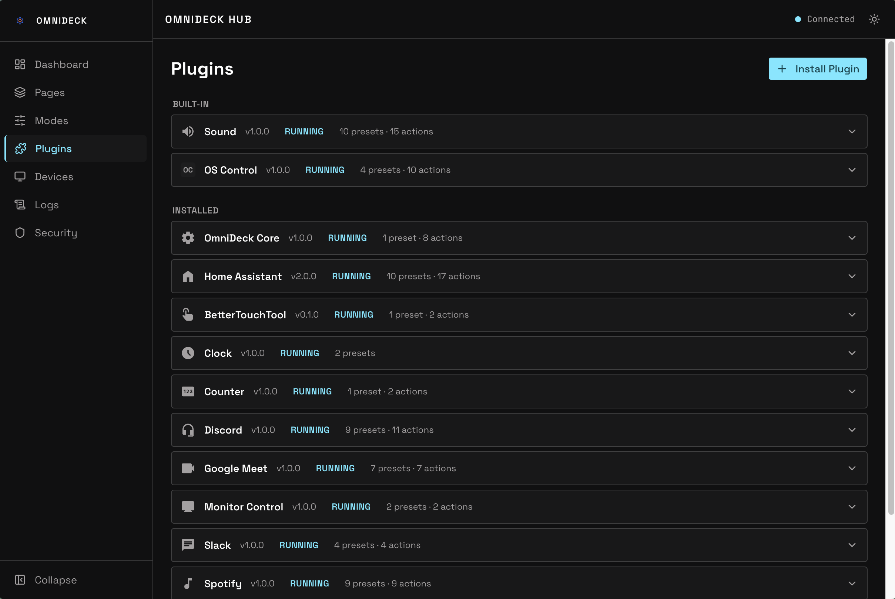
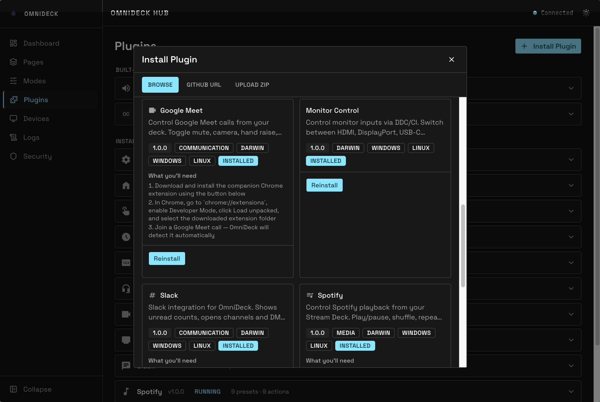
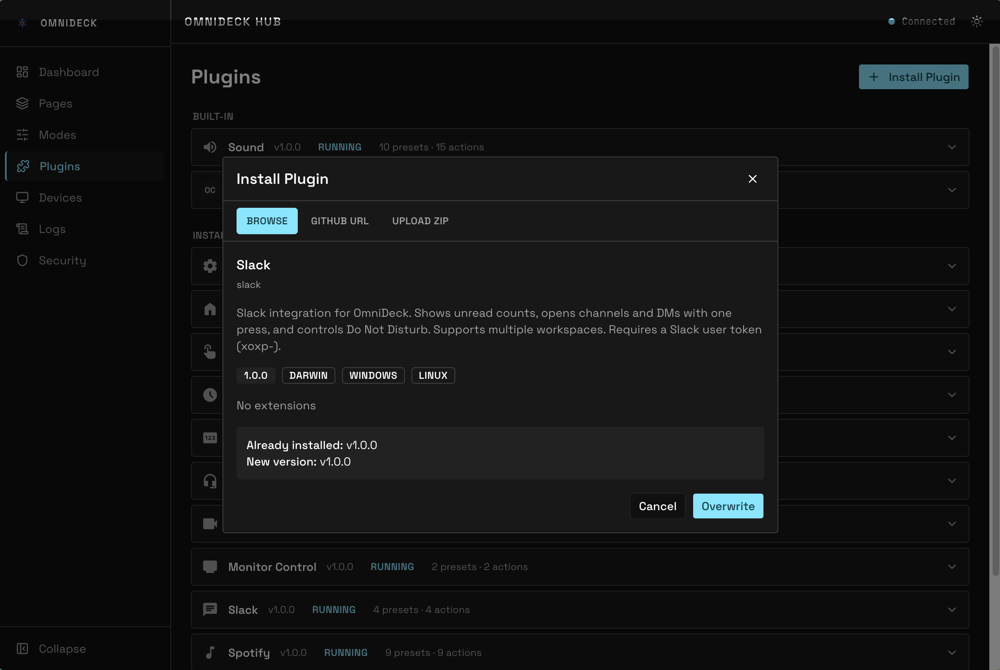
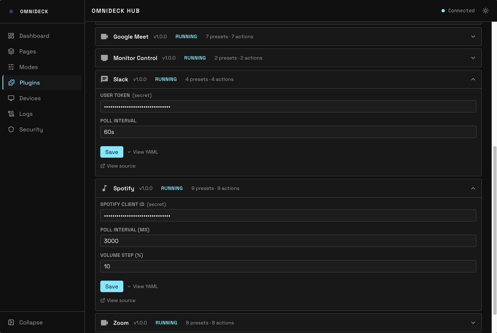
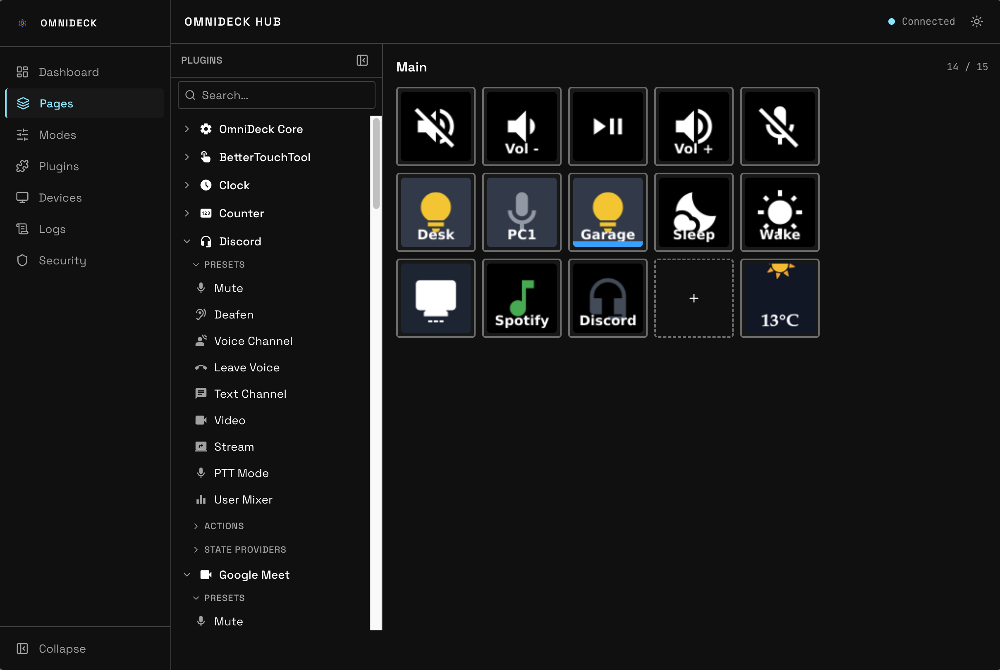

← [Docs](README.md)

# Installing Plugins

## From the web UI

Open the OmniDeck web UI and go to **Plugins** in the sidebar.



### Browse and install

Click **Install Plugin** to open the plugin browser. The modal shows all available plugins from the [OmniDeck-plugins](https://github.com/wemcdonald/OmniDeck-plugins) repository.



Click any plugin to see:
- A description of what it does
- **What you'll need** — setup steps (OAuth, API keys, permissions) required before the plugin will work
- The plugin type (Hub, Agent, or Hybrid)

Click **Install** to download and activate the plugin. It appears in the **Installed** section immediately — no hub restart needed.



### Configure the plugin

Click the installed plugin's row to expand it. The config form is generated automatically from the plugin's schema.

Fill in the required fields:
- **Regular fields** — text inputs, dropdowns, number sliders
- **Secret fields** — shown as `••••••••` if already set, or empty if not. Type the value once; it's stored in `secrets.yaml` and never shown again.
- **Entity pickers** (Home Assistant) — search and select HA entities by name or domain

Click **Save**. The plugin initializes and its status indicator turns green.



## Using presets on buttons

After installing a plugin, its presets appear in the plugin browser on the Pages editor. Each preset is a pre-packaged button config — action, state provider, icon, and default label all set up.

To use a preset:
1. Open a page in the **Pages** editor
2. Find the plugin in the right sidebar and expand it to see its presets
3. Drag a preset onto an empty button slot in the deck grid (or click the slot then click the preset)
4. The button config panel opens — adjust params, label, or appearance as needed
5. Click **Save**



## Advanced: manual install

For plugins not in the curated list, or for development:

### Upload a zip

In the **Install Plugin** modal, scroll to the bottom and click **Upload zip**. The zip must contain a plugin directory at its root:

```
my-plugin.zip
  my-plugin/
    manifest.yaml
    hub.ts
    agent.ts (optional)
```

### Drop a directory

SSH into the Pi and drop the plugin folder into the hub's `plugins/` directory:

```bash
scp -r my-plugin/ pi@raspberrypi.local:~/OmniDeck/plugins/
```

The hub detects new directories in `plugins/` and loads them automatically. Check the logs if the plugin doesn't appear:

```bash
journalctl -u omnideck-hub -f
```

For local development, symlink your plugin directory instead of copying:

```bash
ln -s /path/to/my-plugin ~/OmniDeck/plugins/my-plugin
```

### Install from a GitHub URL

In the **Install Plugin** modal, paste a GitHub repository URL into the search bar:

```
https://github.com/user/repo/tree/main/my-plugin
```

The hub clones the plugin directory directly into `plugins/`.

## Removing a plugin

In the **Plugins** page, expand the plugin row and click **Remove**. This unloads the plugin and removes its directory from `plugins/`. Its config in `config.yaml` and any secrets in `secrets.yaml` are left in place — remove them manually if you don't plan to reinstall.
